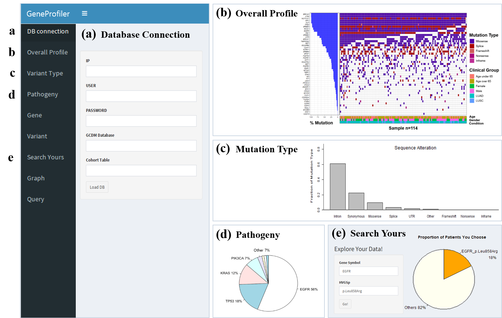
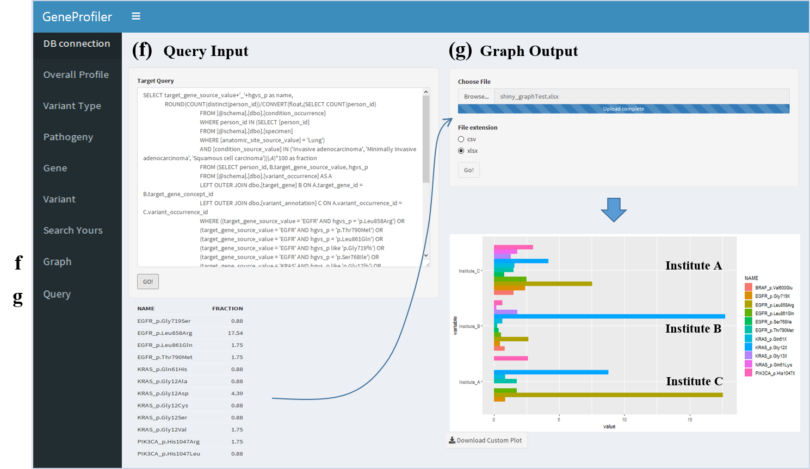

# GeneProfiler
Application running on [Genomic CDM (G-CDM)](https://github.com/ABMI/GeneProfiler/wiki) for exploring and analysis clinical sequencing data

# Explore Your Data


# Run Distributed Research


# How to run

1. Install genomic package.

Using devtools, install genomic package in Rstudio.

```
install.packages("devtools")
devtools::install_github("https://github.com/ABMI/GeneProfiler.git")
```

(If you want to install other branch, add parameter)

```
install_github("https://github.com/ABMI/G-CDM.git", ref = "develop")
```

Username issue

```
install_github("https://github.com/ABMI/Geneprofiler.git", ref = "develop", username = "ABMI"GeneProfiler")
```

2. Run genomic()

```
genomic::genomic()
```
